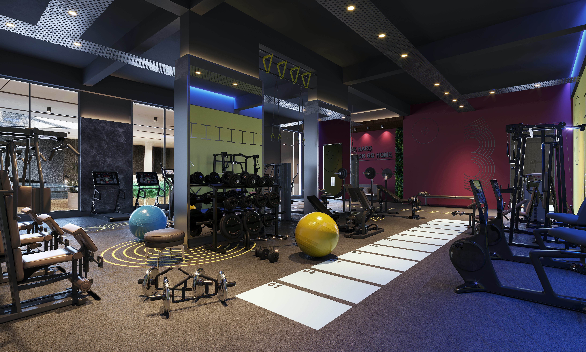

# 💪 Fitzeous Fitness Club

A modern, responsive fitness club website with an AI-powered chatbot, deployed on Cloudflare Pages.

**🌐 Live Site:** [https://fitzeous-fitness.pages.dev](https://fitzeous-fitness.pages.dev)



## 🌟 Features

- **Single Worker Deployment** - Entire site + API in one Cloudflare Worker
- **AI Chatbot** - Rule-based fitness assistant with instant responses
- **Responsive Design** - Works seamlessly on all devices
- **Lightning Fast** - Global CDN with edge computing
- **Zero Configuration** - No environment variables needed
- **Free Hosting** - Cloudflare Workers free tier is generous

## 📋 Pages

- **Home** - Hero section, services overview, about us, and contact form
- **Events** - Upcoming fitness events and workshops
- **Gallery** - Photo gallery showcasing facilities and training
- **Contact** - Integrated contact section on every page

## 🤖 Chatbot Features

The Fitzeous Fitness Chatbot can answer questions about:

- 🕐 Gym hours and location
- 💳 Membership plans and pricing
- 🏋️ Available services and programs
- 👨‍🏫 Personal training options
- 🥗 Nutrition guidance
- 🏢 Equipment and facilities
- 📅 Upcoming events

## 🚀 Live Demo

**Visit the live site:** [https://fitzeous-fitness.pages.dev](https://fitzeous-fitness.pages.dev)

### Deploy Your Own

1. Fork this repository
2. Go to [Cloudflare Pages](https://dash.cloudflare.com)
3. Connect your GitHub repo
4. Configure:
   - Build command: (empty)
   - Build output directory: `/`
5. Click "Save and Deploy"

**Your site will be live in 2 minutes!** 🎉

### Local Development

```bash
# Install dependencies
npm install

# Start local server with chatbot
npm run dev

# Visit http://localhost:8000
```

## 📁 Project Structure

```
FITNESS-WEBSITE/
├── index.html              # Home page
├── fitevents.html          # Events page
├── fitgallery.html         # Gallery page
├── fitstyle.css            # Main stylesheet
├── fitzeous.js             # Navigation & forms
├── chatbot.js              # Chatbot frontend widget
├── worker.js               # Unified Cloudflare Worker (site + API)
├── wrangler.toml           # Worker configuration
├── package.json            # Dependencies
├── README.md               # This file
├── DEPLOYMENT.md           # Detailed deployment guide
└── assets/                 # Images and media
    ├── logo-white.png
    ├── fitcover.jpg
    ├── fit1-3.jpg
    ├── pfit1-8.jpeg
    └── fitness.mp4
```

## 🛠️ Technologies

- **HTML5/CSS3** - Modern semantic markup and styling
- **Vanilla JavaScript** - No frameworks, pure JS
- **Cloudflare Workers** - Edge computing platform
- **Workers Assets** - Static file serving
- **KV Asset Handler** - Efficient asset delivery

## 🎨 Customization

### Update Contact Info

Replace placeholders in HTML files:

```html
www.fitzeousxxxx.com     → your-domain.com
info@fitzeousxxxx.com    → your-email@domain.com
+XX XXX XX XX XX         → your-phone-number
```

Then redeploy:
```bash
npm run deploy
```

### Customize Chatbot

Edit `worker.js` and modify the `RESPONSES` object:

```javascript
your_topic: {
  patterns: ['keyword1', 'keyword2'],
  responses: ["Your response here"]
}
```

### Change Colors

Edit `fitstyle.css`:

```css
:root {
  --green-accent: rgb(3, 85, 3);
  --green-hover: rgba(5, 138, 0, 0.5);
}
```

## 🌐 Custom Domain

Add your domain in Cloudflare Dashboard:

1. Workers & Pages → Your Worker
2. Settings → Triggers → Add Custom Domain
3. Enter: `www.yoursite.com`
4. DNS configured automatically!

## 📊 Monitor & Analytics

```bash
# View real-time logs
npx wrangler tail

# Check deployment status
npx wrangler deployments list

# View metrics in Cloudflare Dashboard
```

## 💰 Pricing

### Free Tier (Perfect for most sites!)
- ✅ 100,000 requests/day
- ✅ Unlimited bandwidth
- ✅ Global CDN
- ✅ SSL certificates

### Paid ($5/month)
- ✅ 10M requests/month
- ✅ No daily limits
- ✅ Advanced analytics

## 🔧 Development Commands

```bash
# Install dependencies
npm install

# Run locally
npm run dev

# Deploy to production
npm run deploy

# View logs
npx wrangler tail

# Rollback deployment
npx wrangler rollback
```

## 📱 Browser Support

- ✅ Chrome (latest)
- ✅ Firefox (latest)
- ✅ Safari (latest)
- ✅ Edge (latest)
- ✅ Mobile browsers

## 🔒 Security

- ✅ Automatic HTTPS
- ✅ DDoS protection
- ✅ No user data stored
- ✅ Stateless chatbot
- ✅ CORS configured

## 🐛 Troubleshooting

### Deployment Issues

```bash
# Re-login
npx wrangler logout
npx wrangler login

# Reinstall dependencies
rm -rf node_modules
npm install
```

### Chatbot Not Working

1. Check browser console (F12)
2. Verify deployment: `npx wrangler deployments list`
3. Test API: `curl https://your-worker.workers.dev/api/health`

See [DEPLOYMENT.md](DEPLOYMENT.md) for detailed troubleshooting.

## 📚 Documentation

- **[DEPLOYMENT.md](DEPLOYMENT.md)** - Complete deployment guide
- **[Cloudflare Workers Docs](https://developers.cloudflare.com/workers/)**
- **[Wrangler CLI Docs](https://developers.cloudflare.com/workers/wrangler/)**

## 🎯 Production Checklist

- [ ] Update contact information
- [ ] Test on mobile devices
- [ ] Test chatbot functionality
- [ ] Verify all images load
- [ ] Check all navigation links
- [ ] Test contact form validation
- [ ] Set up custom domain
- [ ] Review browser console
- [ ] Test in multiple browsers

## 📄 License

This project is licensed under the MIT License - see the [LICENSE](LICENSE) file for details.

## 🤝 Contributing

Contributions welcome! Feel free to:

1. Fork the repository
2. Create a feature branch
3. Make your changes
4. Submit a pull request

## 🎯 Future Enhancements

- [ ] Member login portal
- [ ] Online class booking
- [ ] Payment integration
- [ ] Blog section
- [ ] Workout tracking
- [ ] Multi-language support
- [ ] Progressive Web App (PWA)

## 📞 Support

- 📧 Email: info@fitzeousxxxx.com
- 🌐 Website: www.fitzeousxxxx.com
- 💬 Use the chatbot!

## 🙏 Acknowledgments

- Cloudflare for excellent Workers platform
- Modern fitness website design inspiration
- Open source community

---

## 🚀 Quick Deploy Summary

```bash
# One-time setup
npm install
npx wrangler login

# Deploy (every time you make changes)
npm run deploy

# That's it! Your site is live globally in seconds! 🌍
```

**Made with 💪 by Fitzeous Team**

*Stay fit, stay healthy!*